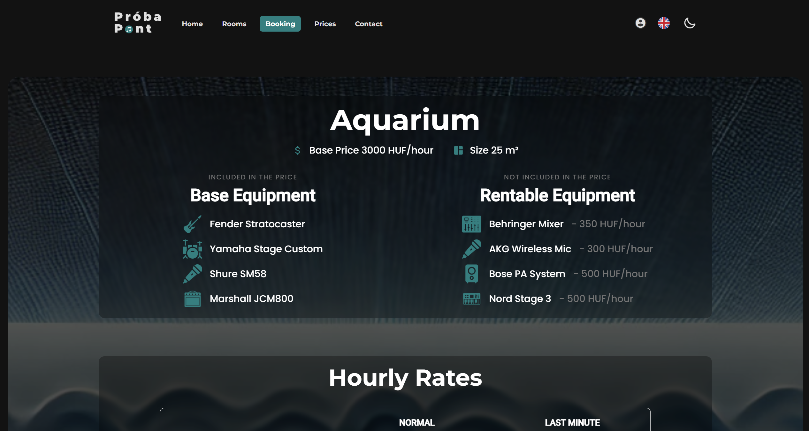

# ProbaPont

A responsive web application for music rehearsal room businesses. The site allows venues to post static content (rooms, contact info, pricing, equipment details) while users can register, log in via full Firebase authentication, and book available time periods on specific rooms.

---

## Table of Contents

- [About The Project](#about-the-project)
- [Features](#features)
- [Built With](#built-with)
- [Future Plans](#future-plans)
- [Usage](#usage)
- [Troubleshooting](#troubleshooting)
- [Contributors](#contributors)
- [Acknowledgments](#acknowledgments)

---

## About The Project

This project is designed as a business site for music rehearsal rooms. Venues can showcase their static content, including room details, pricing, equipment, and contact information. Users can sign up, log in, and book time slots in available rooms—all powered by Firebase as the backend. The project is built with Angular and TypeScript, and styled using Tailwind CSS for a modern, responsive design.

---

## Features

- **User Authentication:** Full authentication using Firebase.
- **Room Listings:** Venues can list their music rehearsal rooms with detailed static content.
- **Booking System:** Users can browse rooms and book available time periods.
- **Responsive Design:** Built with Tailwind CSS for optimal viewing on all devices.
- **Static Content Management:** Venues can manage and update their contact, pricing, and equipment information.

---

## Built With

- **[![Angular][Angular]][Angular-url]** & **[![TypeScript][TypeScript]][TypeScript-url]**: The core framework and language for building the client-side application.
- **[![Firebase][Firebase]][Firebase-url]**: Provides backend services including authentication and real-time data management.
- **[![TailwindCSS][TailwindCSS]][TailwindCSS-url]**: Provides a modern and responsive design system.
- **[![Docker][Docker]][Docker-url]**: Containerization for easy deployment and testing.
- **[![NGINX][NGINX]][NGINX-url]**: Acts as a reverse proxy and static server to efficiently serve the application and manage traffic.
- **Other Tools:**
  - [Angular CLI](https://angular.io/cli) for project scaffolding and development.
  - [Firebase CLI](https://firebase.google.com/docs/cli) for managing backend services.

---

## Future Plans

  - [x] Dockerize project
  - [x] README
  - [ ] **Stripe Integration:** Enable card payments for room bookings.
  - [ ] **Enhanced Booking Features:** Improve the scheduling interface and add calendar integrations.
  - [ ] **User Reviews & Ratings:** Allow users to rate rooms and provide feedback.
  - [ ] **Admin Dashboard:** Build a dedicated area for venue owners to manage bookings and content more efficiently.
  - [ ] **Performance Enhancements:** Further optimize the application for speed and scalability.
---

### Usage
You can reach the site on: https://probapont.web.app/

Static Pages: Browse room details, pricing, and equipment information.
User Account: Register and log in using the Firebase authentication system.
Booking: Once logged in, users can select available time slots for a room and book their rehearsal sessions.
Admin Actions: Venue owners can update static content such as room details and pricing.

## Screenshots

Below are some screenshots of the application in action:

- **Home Page:**  
  The home page provides an overview of available rehearsal rooms and easy navigation to different sections of the site.  
  

- **Booking Page:**  
  The booking page allows users to view room details, select available time slots, and proceed with the booking process.  
  

- **Room Details:**  
  This page displays comprehensive information about a selected room, including equipment, pricing, and contact details.  
  

**Note:**  
This project is still in the development phase.

### Troubleshooting

- Angular Errors: If you encounter issues during development, ensure your Angular version is compatible with your Firebase and Tailwind CSS setups.

- Firebase Issues: Verify that your Firebase configuration is correct and that the necessary Firebase services (authentication, Firestore, etc.) are enabled.

- Port Conflicts: Make sure no other applications are running on port 4200 when starting the Angular server or Docker container.

### Contributors:
- **Pojbics Máté**  
  GitHub: https://github.com/matet2001  
  Email: matet2001@gmail.com  
  [![LinkedIn][linkedin-shield]][linkedin-url]

## Acknowledgments

- [Angular Documentation](https://angular.io/docs)
- [Firebase Documentation](https://firebase.google.com/docs)
- [Tailwind CSS Documentation](https://tailwindcss.com/docs)
- [Stripe API](https://stripe.com/docs) – (Future integration)

[Angular]: https://img.shields.io/badge/Angular-DD0031?style=for-the-badge&logo=angular&logoColor=white
[Angular-url]: https://angular.io/

[TypeScript]: https://img.shields.io/badge/TypeScript-3178C6?style=for-the-badge&logo=typescript&logoColor=white
[TypeScript-url]: https://www.typescriptlang.org/

[Firebase]: https://img.shields.io/badge/Firebase-FFCA28?style=for-the-badge&logo=firebase&logoColor=black
[Firebase-url]: https://firebase.google.com/

[TailwindCSS]: https://img.shields.io/badge/TailwindCSS-06B6D4?style=for-the-badge&logo=tailwindcss&logoColor=white
[TailwindCSS-url]: https://tailwindcss.com/

[Docker]: https://img.shields.io/badge/Docker-2496ED?style=for-the-badge&logo=docker&logoColor=white
[Docker-url]: https://www.docker.com/

[NGINX]: https://img.shields.io/badge/NGINX-009639?style=for-the-badge&logo=nginx&logoColor=white
[NGINX-url]: https://nginx.org/

[linkedin-shield]: https://img.shields.io/badge/-LinkedIn-black.svg?style=for-the-badge&logo=linkedin&colorB=555
[linkedin-url]: https://www.linkedin.com/in/m%C3%A1t%C3%A9-pojbics/